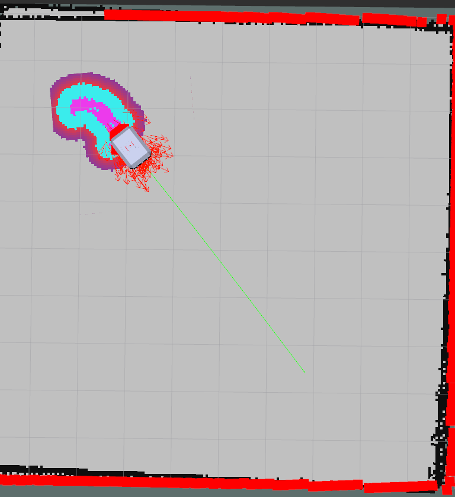
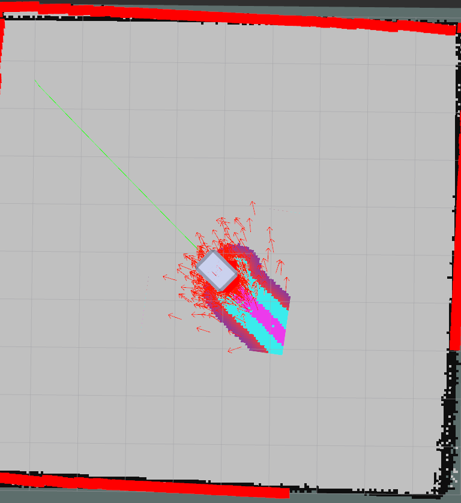
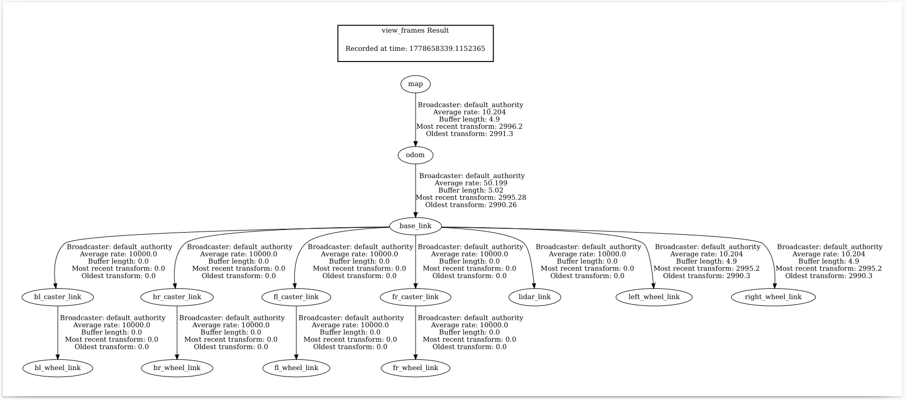

# openamrobot-nav2

ROS 2 navigation package for the Open Mobile Robot (OMR) — combines **Nav2**, **SLAM Toolbox**, and **AMCL** into a ready-to-run simulation stack with full `.devcontainer` support.

---

## Features

- **SLAM mapping** — online async SLAM via `slam_toolbox` to build occupancy grid maps in real time
- **Localization** — AMCL particle-filter localization on a pre-built map
- **Navigation** — full Nav2 stack (planner, controller, smoother, behavior trees, waypoint follower, collision monitor, docking)
- **Simulation-ready** — all launch files default `use_sim_time:=true` for Gazebo Harmonic
- **Dev container** — one-click Docker environment based on `osrf/ros:jazzy-desktop-full`

---

## Package Layout

```
my_robot_nav/
├── .devcontainer/
│   ├── devcontainer.json   # VS Code dev container configuration
│   └── Dockerfile          # ROS 2 Jazzy image with dependencies
├── config/
│   ├── slam.yaml           # SLAM Toolbox parameters (loaded by online_async_launch.py)
│   ├── nav2_params.yaml    # Nav2 stack parameters
│   └── nav2_view.rviz      # RViz preset for navigation
├── images/
│   ├── image1.png          # RViz — SLAM mapping with particle cloud and laser scans
│   ├── image2.png          # RViz — robot navigating with AMCL and goal line
│   └── tf_frame.png        # TF tree — full transform chain from map to all robot links
├── launch/
│   ├── online_async_launch.py    # SLAM mapping (async mode)
│   ├── localization_launch.py    # AMCL localization on a saved map
│   ├── navigation_launch.py      # Nav2 navigation stack
│   └── sim_bringup_launch.py     # All-in-one: localization + nav + RViz
├── maps/
│   ├── my_map.pgm          # Pre-built occupancy grid image
│   └── my_map.yaml         # Map metadata (resolution 0.05 m/px)
├── package.xml
├── setup.cfg
└── setup.py
```

---

## Prerequisites

| Requirement | Version |
|---|---|
| ROS 2 | Jazzy |
| Nav2 | Jazzy release |
| SLAM Toolbox | Jazzy release |
| Gazebo | Harmonic |
| Python | 3.10+ |

Install Nav2 and SLAM Toolbox:

```bash
sudo apt install \
  ros-jazzy-nav2-bringup \
  ros-jazzy-slam-toolbox \
  ros-jazzy-nav2-amcl \
  ros-jazzy-nav2-map-server \
  ros-jazzy-nav2-lifecycle-manager \
  ros-jazzy-opennav-docking
```

---

## Dev Container (Recommended)

The package includes a `.devcontainer/` that sets up a fully configured ROS 2 Jazzy Docker environment.

**Dockerfile** — built on `osrf/ros:jazzy-desktop-full`, installs:

| Package | Purpose |
|---|---|
| `python3-colcon-common-extensions` | Build tool |
| `python3-rosdep` | Dependency management |
| `python3-vcstool` | VCS tool for repos |
| `python3-pip` | Python package manager |
| `git`, `tree`, `nano`, `sudo` | Dev utilities |

`/opt/ros/jazzy/setup.bash` is sourced automatically on every shell.

**devcontainer.json** — VS Code extensions installed automatically:

| Extension | Purpose |
|---|---|
| `ms-iot.vscode-ros` | ROS integration |
| `ms-python.python` | Python support |
| `ms-vscode.cpptools` | C++ support |
| `redhat.vscode-yaml` | YAML editing |

**Open in VS Code:**

1. Install the [Dev Containers extension](https://marketplace.visualstudio.com/items?itemName=ms-vscode-remote.remote-containers)
2. Open the workspace root in VS Code
3. Press `Ctrl+Shift+P` → **Dev Containers: Reopen in Container**

---

## Building

```bash
cd /workspaces/open_mobile_robot_ws   # or your local workspace root
source /opt/ros/jazzy/setup.bash
colcon build --symlink-install --packages-select my_robot_nav
source install/setup.bash
```

---

## Usage

### 1 — Build a Map (SLAM)

Run your robot in simulation, then launch SLAM Toolbox in online async mode:

```bash
ros2 launch my_robot_nav online_async_launch.py
```

Key arguments:

| Argument | Default | Description |
|---|---|---|
| `use_sim_time` | `true` | Use Gazebo clock |
| `slam_params_file` | `config/slam.yaml` | Full path to SLAM parameters file |
| `autostart` | `true` | Auto-configure and activate the lifecycle node |
| `use_lifecycle_manager` | `false` | Enable bond connection during node activation |

Drive the robot around to build the map, then save it:

```bash
ros2 run nav2_map_server map_saver_cli -f ~/my_map
```

### 2 — Localize on a Saved Map

```bash
ros2 launch my_robot_nav localization_launch.py \
  map:=/path/to/my_map.yaml \
  use_sim_time:=true
```

Key arguments:

| Argument | Default | Description |
|---|---|---|
| `map` | *(empty — uses params file)* | Full path to map YAML |
| `use_sim_time` | `false` | Set `true` for Gazebo |
| `params_file` | `config/nav2_params.yaml` | Nav2 parameters |
| `use_composition` | `false` | Run nodes in a composable container |
| `use_respawn` | `false` | Restart nodes on crash |
| `log_level` | `info` | ROS logging level |

### 3 — Run the Navigation Stack

```bash
ros2 launch my_robot_nav navigation_launch.py use_sim_time:=true
```

Starts the full Nav2 stack: `controller_server`, `planner_server`, `smoother_server`, `behavior_server`, `bt_navigator`, `waypoint_follower`, `velocity_smoother`, `collision_monitor`, `docking_server`.

### 4 — All-in-One Simulation Bringup

Starts localization (with the bundled `my_map`), the full Nav2 stack, and RViz in one command:

```bash
ros2 launch my_robot_nav sim_bringup_launch.py
```

Optional initial pose arguments:

| Argument | Default | Description |
|---|---|---|
| `initial_pose_x` | `0.0` | Robot X in map frame |
| `initial_pose_y` | `0.0` | Robot Y in map frame |
| `initial_pose_yaw` | `0.0` | Robot yaw in map frame |

After launch, use the **2D Pose Estimate** tool in RViz to set the initial AMCL pose if the robot spawns away from the origin.





The screenshots above demonstrate the robot successfully localizing and navigating within the environment. The AMCL particle filter has converged to a tight, high-confidence pose estimate — visible as a well-clustered particle cloud centred on the robot — confirming accurate global localization against the pre-built occupancy grid. Incoming LiDAR scan rays align precisely with the map boundaries, validating that the transform chain (`map → odom → base_link`) is consistent and drift-free (see [TF Tree](#transform-tree)). The green goal vector indicates an active navigation request being processed by the Nav2 stack; the planner has computed a collision-free global path while the controller server is tracking it in real time, respecting costmap inflation layers around obstacles.

---

## Configuration

### SLAM Toolbox (`config/slam.yaml`)

Notable parameters:

| Parameter | Value | Effect |
|---|---|---|
| `resolution` | `0.05` | Map resolution (metres/cell) |
| `max_laser_range` | `10.0 m` | Maximum usable laser range |
| `map_update_interval` | `5.0 s` | How often the map image is updated |
| `do_loop_closing` | `true` | Enables loop-closure correction |
| `scan_topic` | `/scan` | Expected laser topic name |
| `mode` | `mapping` | Switch to `localization` to reuse a map |
| `solver_plugin` | `CeresSolver` | Non-linear least squares solver |

### Transform Tree

The diagram below shows the complete TF tree published at runtime. `map` is the fixed global frame provided by AMCL; `odom` is the local odometry frame maintained by the robot's motion model; `base_link` is the robot body frame from which all sensor and joint transforms are expressed.



A healthy, fully-connected tree with no gaps between `map`, `odom`, and `base_link` is a prerequisite for both AMCL convergence and Nav2 path planning.

### Nav2 (`config/nav2_params.yaml`)

Parameters for all Nav2 nodes (planner, controller, AMCL, BT navigator, etc.). Edit this file to tune planner algorithms, controller gains, costmap layers, and AMCL particle counts.

### Pre-built Map (`maps/my_map.yaml`)

| Property | Value |
|---|---|
| Resolution | 0.050 m/px |
| Origin | `[-5.391, -5.189, 0]` |
| Occupied threshold | 0.65 |
| Free threshold | 0.196 |
| Mode | trinary |

---

## Related Packages

- [`omr_description`](../omr_description/) — URDF/SDF robot model and Gazebo simulation bringup

---

## License

Apache-2.0
